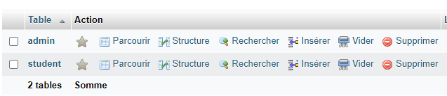

# GESTION DES ETudiant

Une brève description de ce que fait votre projet.

## Les outils utilisés
1. [Introduction](#introduction)
2. [Les prérequis ](#prérequis)
3. [Configuration mysql](#étapes-de-configuration)

## Introduction

On souhaite concevoir et développer une application qui permet de gérer les 
étudiants en Java. 
Un étudiant est caractérisé par un matricule, nom, prénom, sexe, commune et un 
numéro de téléphone

## Installation
    Ce système est développé en utilisant Java et MySQL.
### Prérequis

Indiquez les prérequis nécessaires pour installer votre projet, par exemple :
- Java
- swing
- Une base de données spécifique avec mysql

## Étapes de configuration

### Créer la base de donnée 
    crate database student

### créer les tables
    1. Création de la table admin

    2. création de la table student





### Clonez le projet 
```bash
    # Clonez le dépôt
    git clone https://github.com/KET752SBAH/gestion_student_swing.git

